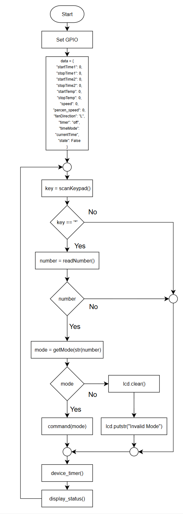
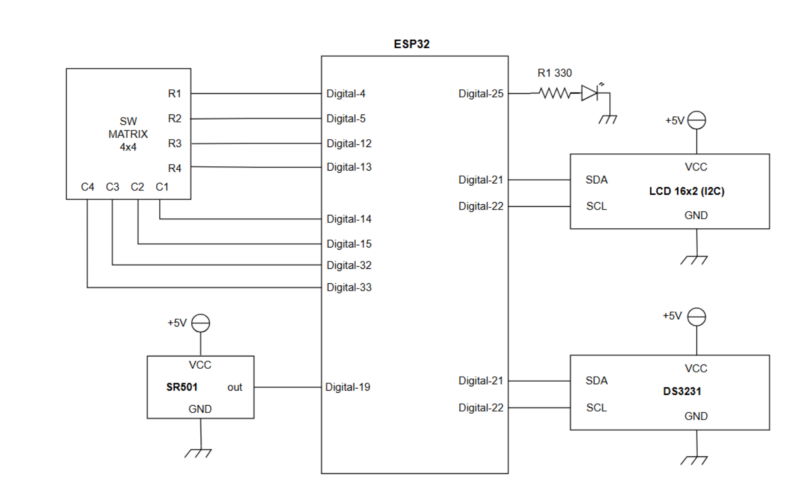
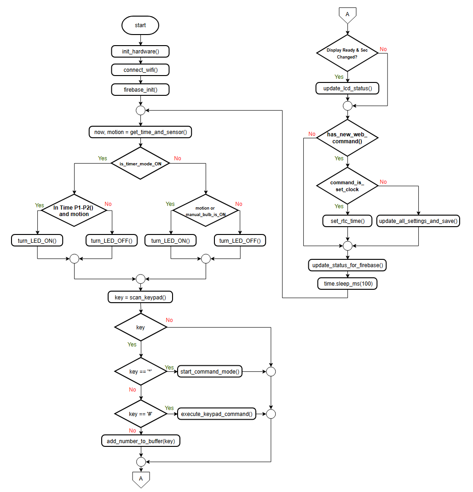
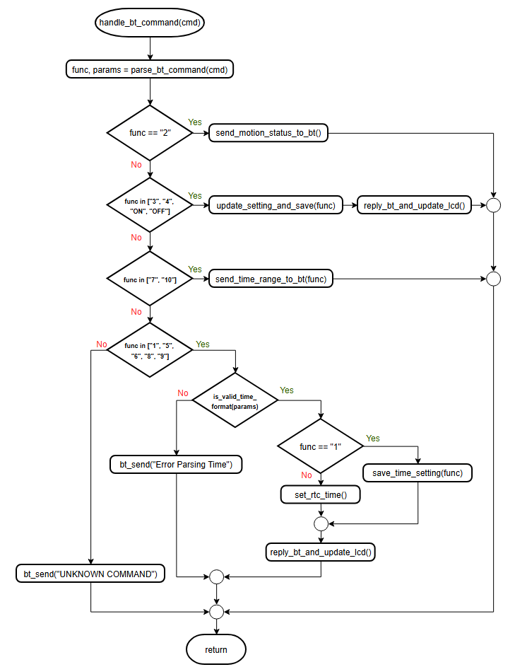
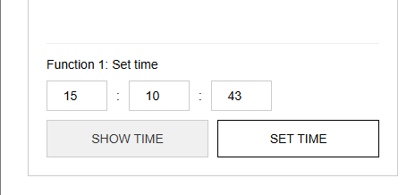
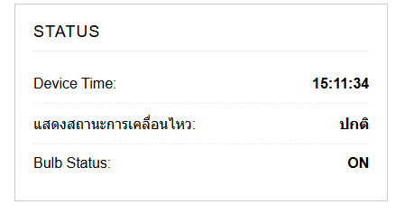
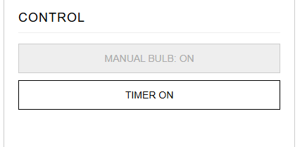
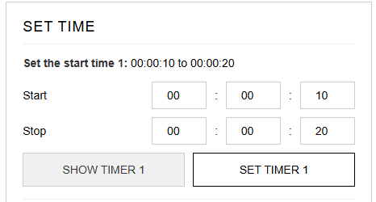

# Microcontroller Mini-Projects — Embedded Systems & IoT (ESP32)

คลังโครงงานวิชาไมโครคอนโทรลเลอร์ (Microcontroller Engineering) พัฒนาบนไมโครคอนโทรลเลอร์ ESP32 ด้วยภาษา MicroPython รวบรวม 2 โครงงานระบบสมองกลฝังตัวและอินเทอร์เน็ตของสรรพสิ่ง (IoT) ที่เน้นการประยุกต์ใช้เซนเซอร์ ไทม์เมอร์ และการสื่อสารไร้สาย:

1. **โครงงานที่ 1: เครื่องควบคุมความเร็วพัดลมตามอุณหภูมิแบบตั้งเวลา (Temperature-Controlled Fan System)**
   - ควบคุมความเร็วและทิศทางมอเตอร์ DC ผ่านสัญญาณ PWM ตามอุณหภูมิแวดล้อม (DHT22)
   - กำหนดช่วงเวลาเปิด-ปิดอัตโนมัติ 2 ช่วงเวลาอิสระ (DS3231 RTC) พร้อมอินพุตคีย์แพ็ด 4x4
2. **โครงงานที่ 2: เครื่องควบคุมหลอดไฟตามการเคลื่อนไหวแบบตั้งเวลาผ่านเว็บไซด์และบลูทูธ (Smart Motion-Activated Light Controller with BLE & Firebase Web Control)**
   - ตรวจจับความเคลื่อนไหวด้วยเซนเซอร์อินฟราเรด PIR (HC-SR501) ร่วมกับเงื่อนไขตัวตั้งเวลา 2 ช่วง
   - รองรับการสั่งการ 3 ช่องทางพร้อมกัน: คีย์แพ็ด 4x4, บลูทูธพลังงานต่ำ (BLE UART), และเว็บแดชบอร์ดผ่าน Firebase Realtime Database

---

## สารบัญโครงสร้าง Repository

```text
microcontroller-mini-project-fan-controller/
├── projects/
│   ├── 01-temperature-fan-controller/       # โครงงานควบคุมพัดลมตามอุณหภูมิและเวลา
│   │   ├── main.py                          # เฟิร์มแวร์ MicroPython ควบคุมพัดลม
│   │   └── README.md                        # เอกสารอธิบายโครงงานพัดลมฉบับเต็ม
│   │
│   └── 02-motion-light-controller/          # โครงงานควบคุมหลอดไฟตามการเคลื่อนไหวและ IoT
│       ├── firmware/
│       │   └── main.py                      # เฟิร์มแวร์ MicroPython (BLE + Firebase + PIR + RTC)
│       ├── web/
│       │   └── index.html                   # เว็บแดชบอร์ดเชื่อมต่อ Firebase Realtime Database
│       └── README.md                        # เอกสารอธิบายโครงงานหลอดไฟอัจฉริยะฉบับเต็ม
│
├── lib/                                     # ไลบรารีไดรเวอร์ฮาร์ดแวร์ MicroPython
│   ├── ds3231.py                            # ไดรเวอร์ Real-Time Clock โมดูล DS3231 (I2C)
│   ├── i2c_lcd.py                           # ไดรเวอร์จอแสดงผล LCD 16x2 ผ่านบัส I2C (PCF8574)
│   └── lcd_api.py                           # คลาสฐานคำสั่งจัดการตัวอักษรและตำแหน่งเคอร์เซอร์บน LCD
│
├── docs/
│   └── images/
│       ├── fan-controller/                  # วงจร โฟลว์ชาร์ต และภาพถ่ายผลการทดสอบพัดลม 16 กรณี
│       └── motion-light/                    # วงจร โฟลว์ชาร์ต และภาพถ่ายผลการทดสอบระบบหลอดไฟ
│
├── main.py                                  # สคริปต์รันเริ่มต้นบนบอร์ด ESP32 (พัดลม)
└── README.md
```

---

## ภาพรวมและการเปรียบเทียบทั้งสองโครงงาน

| คุณลักษณะ | โครงงานที่ 1: พัดลมอัจฉริยะ | โครงงานที่ 2: หลอดไฟตรวจจับความเคลื่อนไหว |
|---|---|---|
| **ไมโครคอนโทรลเลอร์** | ESP32 NodeMCU | ESP32 NodeMCU |
| **เซนเซอร์ตรวจวัด** | DHT22 (วัดอุณหภูมิและความชื้น) | PIR HC-SR501 (ตรวจจับการเคลื่อนไหว) |
| **การควบคุมเวลา** | DS3231 Real-Time Clock (I2C) | DS3231 Real-Time Clock (I2C) |
| **อุปกรณ์เอาต์พุต** | DC Motor + ไดรเวอร์ ET-MINI (PWM & ทิศทาง) | หลอดไฟ / LED Relay Module (Pin 25) |
| **การแสดงผล** | 16x2 I2C LCD (0x27) สลับหน้าจออัตโนมัติทุก 5 วินาที | 16x2 I2C LCD (0x27) แสดงเวลาและสถานะตรวจจับ |
| **อินเทอร์เฟซควบคุม** | 4x4 Keypad (14 ฟังก์ชันคำสั่ง) | 4x4 Keypad + BLE UART + Firebase Web App |
| **การเชื่อมต่อไร้สาย** | - | Wi-Fi (802.11 b/g/n) + BLE 4.2 UART Service |
| **การเก็บบันทึกสถานะ** | Persistent Flash Storage (`data.txt`) | Persistent Flash Storage (`data.json`) |

---

## 1. โครงงานที่ 1: เครื่องควบคุมความเร็วพัดลมตามอุณหภูมิแบบตั้งเวลา

### สถาปัตยกรรมและตารางการต่อวงจร (Hardware Pinout)

<div align="center">
  
</div>

| อุปกรณ์ / โมดูล | ขาสัญญาณ | ขาบอร์ด ESP32 | หน้าที่การทำงาน |
|---|---|---|---|
| **DHT22** | DATA | `GPIO 18` (Pull-up 10k) | เซนเซอร์วัดอุณหภูมิห้อง |
| **DS3231 RTC** | SDA / SCL | `GPIO 21` / `GPIO 22` | โมดูลนาฬิกาเวลาจริง I2C Bus |
| **I2C LCD 16x2** | SDA / SCL | `GPIO 21` / `GPIO 22` | หน้าจอแสดงผลเวลา อุณหภูมิ สถานะพัดลม |
| **DC Motor Driver** | EN / IN1 / IN2 | `GPIO 5` / `GPIO 16` / `GPIO 17` | ควบคุมเปิด-ปิด, ความเร็ว (PWM1/PWM2 5kHz), ทิศทาง L/R |
| **4x4 Matrix Keypad** | Rows (R1-R4) | `GPIO 12, 13, 14, 15` | แถวแนวนอน (Digital Output) |
| **4x4 Matrix Keypad** | Cols (C1-C4) | `GPIO 26, 27, 32, 33` | คอลัมน์แนวตั้ง (Input Pull-Down) |

### แผนผังโฟลว์ชาร์ตการทำงาน (Flowchart)

<div align="center">
  
</div>

### สรุปฟังก์ชันคำสั่งผ่านคีย์แพ็ด (14 Functions)

การตั้งค่าทำได้โดยกดปุ่ม `*` ตามด้วยหมายเลขฟังก์ชัน และยืนยันด้วย `#` (เช่น `*1#`):

| รหัสฟังก์ชัน | คำสั่ง (Operation) | รายละเอียดและการตั้งค่า |
|---|---|---|
| `1` | Set time | ตั้งค่าเวลาปัจจุบันของนาฬิกา RTC (HH:MM:SS) |
| `2` | Set speed control | กำหนดความเร็วรอบพัดลม (1-100%) แปลงเป็นค่า PWM Duty (300-1023) |
| `3` | Set rotate direction | กำหนดทิศทางการหมุน (1: ซ้าย, 2: ขวา) |
| `4` | TIMER OFF | ปิดการทำงานโหมดตั้งเวลา |
| `5` | TIMER ON | เปิดการทำงานโหมดตั้งเวลาอัตโนมัติ |
| `6` | Set the start time 1 | กำหนดเวลาเริ่มทำงานช่วงที่ 1 |
| `7` | Set the stop time 1 | กำหนดเวลาหยุดทำงานช่วงที่ 1 |
| `8` | Show the start & stop time 1 | แสดงช่วงเวลาทำงานที่ 1 บนจอ LCD |
| `9` | Set the start time 2 | กำหนดเวลาเริ่มทำงานช่วงที่ 2 |
| `10` | Set the stop time 2 | กำหนดเวลาหยุดทำงานช่วงที่ 2 |
| `11` | Show the start & stop time 2 | แสดงช่วงเวลาทำงานที่ 2 บนจอ LCD |
| `12` | Set the start temp | กำหนดค่าอุณหภูมิขั้นต่ำที่พัดลมเริ่มหมุน |
| `13` | Set the stop temp | กำหนดค่าอุณหภูมิสูงสุดที่พัดลมหยุดหมุน |
| `14` | Show the start & stop temp | แสดงช่วงอุณหภูมิที่ควบคุมบนจอ LCD |

### ผลการทดสอบการทำงานจริง (Selected Test Cases)

<div align="center">
  <table>
    <tr>
      <td align="center" width="50%">
        <br>
        <b>Case 02: กำหนดความเร็ว 60% หมุนซ้าย</b>
      </td>
      <td align="center" width="50%">
        <br>
        <b>Case 03: สลับทิศทางหมุนขวา</b>
      </td>
    </tr>
    <tr>
      <td align="center">
        <br>
        <b>Case 08: แสดงช่วงเวลาที่ 1 (00:01:00 - 00:02:00)</b>
      </td>
      <td align="center">
        <br>
        <b>Case 15: มอเตอร์ทำงานจริงเมื่อถึงเวลาและอุณหภูมิ</b>
      </td>
    </tr>
  </table>
</div>

---

## 2. โครงงานที่ 2: เครื่องควบคุมหลอดไฟตามการเคลื่อนไหวแบบตั้งเวลาผ่านเว็บไซด์และบลูทูธ

### สถาปัตยกรรมและตารางการต่อวงจร (Hardware Pinout)

<div align="center">
  
</div>

| อุปกรณ์ / โมดูล | ขาสัญญาณ | ขาบอร์ด ESP32 | หน้าที่การทำงาน |
|---|---|---|---|
| **PIR Sensor (HC-SR501)** | OUT | `GPIO 19` | เซนเซอร์ตรวจจับความเคลื่อนไหวของมนุษย์ |
| **Light Bulb / LED** | Control Signal | `GPIO 25` | รีเลย์หรือไฟส่องสว่างหลัก |
| **DS3231 RTC** | SDA / SCL | `GPIO 21` / `GPIO 22` | โมดูลนาฬิกาเวลาจริง I2C Bus |
| **I2C LCD 16x2** | SDA / SCL | `GPIO 21` / `GPIO 22` | แสดงเวลา สถานะการตรวจจับ และสถานะหลอดไฟ/ไทม์เมอร์ |
| **4x4 Matrix Keypad** | Rows (R1-R4) | `GPIO 4, 5, 12, 13` | แถวแนวนอน (Digital Output) |
| **4x4 Matrix Keypad** | Cols (C1-C4) | `GPIO 14, 15, 32, 33` | คอลัมน์แนวตั้ง (Input Pull-Down) |

### แผนผังการทำงานระบบ (Flowcharts)

<div align="center">
  <table>
    <tr>
      <td align="center" width="50%">
        <br>
        <b>Main Routine & Sensor Logic</b>
      </td>
      <td align="center" width="50%">
        <br>
        <b>BLE UART Command Handler</b>
      </td>
    </tr>
  </table>
</div>

### ระบบควบคุมและการสื่อสาร 3 ช่องทาง

1. **การควบคุมผ่าน Keypad 4x4 และจอ LCD**
   - รหัส `*1#` ถึง `*10#` สำหรับตั้งเวลาและตรวจสอบสถานะแบบ Standalone โดยไม่ต้องพึ่งเครือข่าย
2. **การสื่อสารผ่าน Bluetooth Low Energy (BLE)**
   - ใช้ Nordic UART Service UUID: `6E400001-B5A3-F393-E0A9-E50E24DCCA9E`
   - รองรับคำสั่งข้อความ เช่น `ON`, `OFF`, `2` (อ่านค่าความเคลื่อนไหว), `3` (Timer OFF), `4` (Timer ON)
3. **การควบคุมผ่าน Web Dashboard & Firebase Realtime Database**
   - เว็บแอพพลิเคชันหน้าเดียว (SPA) เชื่อมต่อ Firebase Realtime Database แบบ Two-way Synchronization
   - แยกเธรดการซิงค์ข้อมูลบน ESP32 ด้วย `_thread.start_new_thread(firebase_thread, ())` ทำให้ระบบฮาร์ดแวร์ทำงานได้ลื่นไหลไม่สะดุด

### ผลการทดสอบหน้าจอ LCD จากการสั่งการจริง

<div align="center">
  <table>
    <tr>
      <td align="center" width="50%">
        <br>
        <b>ตั้งเวลาผ่านเว็บสำเร็จ (Web: Set Time Updated)</b>
      </td>
      <td align="center" width="50%">
        <br>
        <b>PIR Sensor ตรวจพบความเคลื่อนไหว (Status: Detect)</b>
      </td>
    </tr>
    <tr>
      <td align="center">
        <br>
        <b>เปิดโหมดตั้งเวลา (Func 4 TIMER ON)</b>
      </td>
      <td align="center">
        <br>
        <b>แสดงช่วงเวลาทำงาน T1 (00:00:10 ถึง 00:00:20)</b>
      </td>
    </tr>
  </table>
</div>

---

## คำแนะนำในการติดตั้งและใช้งาน (Getting Started)

### อุปกรณ์ที่ต้องจัดเตรียม
- บอร์ดไมโครคอนโทรลเลอร์ ESP32 NodeMCU
- สาย Micro USB สำหรับเบิร์นเฟิร์มแวร์และสื่อสาร Serial
- โมดูลเซนเซอร์: DHT22, PIR HC-SR501, DS3231 RTC, 4x4 Matrix Keypad, 16x2 I2C LCD, ไดรเวอร์มอเตอร์ ET-MINI / L298N

### ขั้นตอนการติดตั้งเฟิร์มแวร์

1. **ติดตั้งไดรเวอร์ Thonny IDE หรือ esptool**
2. **แฟลช MicroPython Firmware** ลงบน ESP32:
   ```bash
   esptool.py --chip esp32 --port COM3 erase_flash
   esptool.py --chip esp32 --port COM3 --baud 460800 write_flash -z 0x1000 ESP32_GENERIC-xxxx.bin
   ```
3. **อัปโหลดไฟล์ไดรเวอร์ใน `lib/` ไปยังหน่วยความจำบอร์ด**:
   - `lib/ds3231.py`
   - `lib/i2c_lcd.py`
   - `lib/lcd_api.py`
4. **เลือกโปรเจกต์ที่ต้องการใช้งาน**:
   - **รันระบบพัดลม**: อัปโหลด `projects/01-temperature-fan-controller/main.py` เป็น `main.py` บนบอร์ด
   - **รันระบบหลอดไฟ**: อัปโหลด `projects/02-motion-light-controller/firmware/main.py` เป็น `main.py` บนบอร์ด พร้อมแก้ไขค่า Wi-Fi และ Firebase Config ในโค้ด
   - **เปิดเว็บควบคุมหลอดไฟ**: เปิดไฟล์ `projects/02-motion-light-controller/web/index.html` บนเว็บเบราว์เซอร์

---

## ผู้จัดทำและคณะผู้พัฒนา (Contributors)

โครงงานทั้งหมดนี้เป็นผลงานการพัฒนาร่วมกันโดย:

- **[Painter121](https://github.com/Painter121)** (ภูริภัทร มะลิซ้อน)
- **[Akkaradet-Wong](https://github.com/Akkaradet-Wong)** (อัครเดช วงค์บำราบ)
