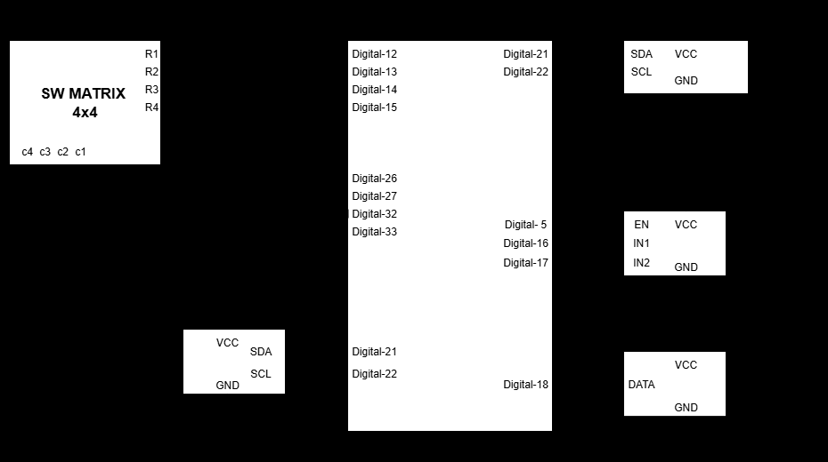

# โครงงานที่ 1: เครื่องควบคุมความเร็วพัดลมตามอุณหภูมิแบบตั้งเวลา (Temperature-Controlled Fan System)

โครงงานพัฒนาระบบควบคุมความเร็วและทิศทางการหมุนของพัดลม DC อัตโนมัติตามค่าอุณหภูมิและช่วงเวลาที่กำหนด พัฒนาด้วยภาษา MicroPython บนบอร์ด ESP32

## คุณสมบัติเด่นของระบบ
- **การควบคุมความเร็ว (Variable Speed PWM):** ปรับความเร็วรอบได้ตั้งแต่ 1-100% ผ่านสัญญาณ PWM ความถี่ 5 kHz
- **การกลับทิศทางการหมุน (Bi-directional Control):** สั่งหมุนซ้าย (Counter-Clockwise) หรือหมุนขวา (Clockwise)
- **การควบคุมอุณหภูมิอัตโนมัติ:** วัดอุณหภูมิด้วยเซนเซอร์ DHT22 และทำงานเฉพาะเมื่ออุณหภูมิอยู่ในช่วง `startTemp` ถึง `stopTemp`
- **ระบบตั้งเวลา 2 ช่วงเวลา (Dual-Timer Scheduling):** กำหนดเวลาเริ่ม-หยุดทำงานได้ 2 ช่วงอิสระด้วยนาฬิกา DS3231 RTC
- **การป้อนข้อมูลและหน้าจอแสดงผล:** สั่งงานผ่าน Keypad 4x4 และแสดงผลบน 16x2 I2C LCD สลับหน้าจอทุก 5 วินาที
- **ระบบบันทึกสถานะถาวร (Non-Volatile Persistence):** จัดเก็บพารามิเตอร์ลงใน `data.txt` บน Flash Memory ของ ESP32 ป้องกันข้อมูลสูญหายเมื่อไฟดับ

## ผังวงจรและการเชื่อมต่อพิน (Pinout)

| อุปกรณ์ | ขาสัญญาณ | ขาบอร์ด ESP32 |
|---|---|---|
| DHT22 | DATA | GPIO 18 (Pull-up 10k) |
| DS3231 RTC | SDA / SCL | GPIO 21 / GPIO 22 |
| I2C LCD 16x2 | SDA / SCL | GPIO 21 / GPIO 22 |
| DC Motor Driver (ET-MINI) | EN / IN1 / IN2 | GPIO 5 / GPIO 16 / GPIO 17 |
| 4x4 Matrix Keypad | R1, R2, R3, R4 | GPIO 12, 13, 14, 15 |
| 4x4 Matrix Keypad | C1, C2, C3, C4 | GPIO 26, 27, 32, 33 |

## ตารางฟังก์ชันคำสั่ง Keypad (14 Functions)

กดปุ่ม `*` ตามด้วยหมายเลขฟังก์ชัน และยืนยันด้วย `#`:
- `*1#`: ตั้งเวลาปัจจุบัน (HH:MM:SS)
- `*2#`: ตั้งความเร็วพัดลม (1-100%)
- `*3#`: ตั้งทิศทางการหมุน (1: ซ้าย, 2: ขวา)
- `*4#`: ปิดไทม์เมอร์
- `*5#`: เปิดไทม์เมอร์
- `*6#`: ตั้งเวลาเริ่มช่วงที่ 1
- `*7#`: ตั้งเวลาหยุดช่วงที่ 1
- `*8#`: แสดงเวลาช่วงที่ 1
- `*9#`: ตั้งเวลาเริ่มช่วงที่ 2
- `*10#`: ตั้งเวลาหยุดช่วงที่ 2
- `*11#`: แสดงเวลาช่วงที่ 2
- `*12#`: ตั้งอุณหภูมิเริ่มทำงาน
- `*13#`: ตั้งอุณหภูมิหยุดทำงาน
- `*14#`: แสดงช่วงอุณหภูมิที่ตั้งไว้

## ผลการทดสอบระบบ 16 กรณี

ตารางบันทึกผลการทดสอบการทำงานจริงพร้อมภาพถ่ายจอ LCD:

| กรณีที่ | คำสั่งคีย์แพ็ด | หน้าจอ LCD | สถานะมอเตอร์ |
|---|---|---|---|
| 1 | `*1# 00#00#00#` | `Set Time now [00:00:00]` | ไม่ทำงาน |
| 2 | `*2# 60#` | `Speed: 60% Direction: Left` | ไม่ทำงาน |
| 3 | `*3# 2#` | `Speed: 60% Direction: Right` | ไม่ทำงาน |
| 4 | `*4#` | `[10:06:20] 24.7C Timer: off` | ไม่ทำงาน |
| 5 | `*5#` | `[10:08:23] 24.7C Timer: on` | ไม่ทำงาน |
| 6 | `*6# 00#01#00#` | `Set Time start1 [00:01:00]` | ไม่ทำงาน |
| 7 | `*7# 00#02#00#` | `Set Time stop1 [00:02:00]` | ไม่ทำงาน |
| 8 | `*8#` | `[1] S:00:01:00 E:00:02:00` | ไม่ทำงาน |
| 9 | `*9# 00#04#00#` | `Set Time start2 [00:04:00]` | ไม่ทำงาน |
| 10 | `*10# 00#06#00#` | `Set Time stop2 [00:06:00]` | ไม่ทำงาน |
| 11 | `*11#` | `[2] S:00:04:00 E:00:06:00` | ไม่ทำงาน |
| 12 | `*12# 28#` | `[Start Temp] >> 28C <<` | ไม่ทำงาน |
| 13 | `*13# 30#` | `[Stop Temp] >> 30C <<` | ไม่ทำงาน |
| 14 | `*14#` | `Temp: 24.6C Set: 28-30 C` | ไม่ทำงาน |
| 15 | *(ถึงช่วงเวลาที่ 1)* | `[00:01:06] 28.0C Timer: on` | **ทำงาน** (อยู่ในช่วงเวลา 00:01-00:02 และอุณหภูมิถึงเกณฑ์) |
| 16 | *(ถึงช่วงเวลาที่ 2)* | `[00:04:30] 28.7C Timer: on` | **ทำงาน** (อยู่ในช่วงเวลา 00:04-00:06 และอุณหภูมิถึงเกณฑ์) |
